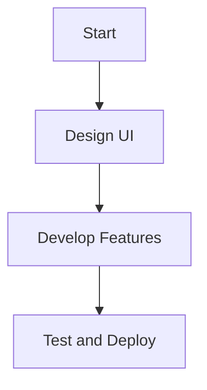

# Project Name: Modern Web Portfolio

## Table of Contents
- [Introduction](#introduction)
- [Features](#features)
- [Technologies Used](#technologies-used)
- [Project Structure](#project-structure)
- [Installation](#installation)
- [Usage](#usage)
- [Code Explanation](#code-explanation)
- [Customization](#customization)
- [Charts and Visuals](#charts-and-visuals)
- [Contributing](#contributing)
- [License](#license)

## Introduction
This is a modern web portfolio template built using HTML, CSS, and JavaScript. It features a responsive design, smooth animations, and an interactive cursor effect.

## Features
- Responsive design
- Smooth scrolling
- Interactive cursor effect
- Grid-based layout
- Animated elements
- Data visualization using charts and flowcharts

## Technologies Used
- HTML5
- CSS3 (Including animations and responsive design techniques)
- JavaScript (For interactivity and cursor effects)
- Chart.js (For data visualization)

## Project Structure
```
project-folder/
│── index.html   # Main HTML structure
│── style.css    # Styles and animations
│── script.js    # JavaScript for interactivity
│── images/      # Image assets
│── charts/      # Flowcharts and pie charts
```

## Installation
1. Clone the repository:
   ```sh
   git clone https://github.com/your-username/your-repo.git
   ```
2. Navigate to the project directory:
   ```sh
   cd your-repo
   ```
3. Open `index.html` in your browser.

## Usage
1. Open the `index.html` file in any modern browser.
2. Navigate through different sections using the navigation bar.
3. Hover over links to see cursor animations.
4. View interactive charts and flowcharts.

## Code Explanation
### HTML Structure (index.html)
The `index.html` file includes a structured layout:
- A navigation menu
- A hero section with an image and text
- Grid-based sections displaying content dynamically
- A footer section with additional information
- A section for charts and data visualization

```html
<section class="charts">
    <h2>Data Visualization</h2>
    <canvas id="myChart"></canvas>
</section>
```

### CSS Styling (style.css)
The `style.css` file is used to style the website, including:
- Custom fonts from Google Fonts
- Grid-based layout styling
- Cursor effects and animations

Example:
```css
.charts {
    width: 80%;
    margin: auto;
    text-align: center;
}
```

### JavaScript Interactivity (script.js)
The `script.js` file handles interactive elements like:
- Custom cursor movement
- Hover effects on navigation links
- Chart rendering using Chart.js

Example:
```js
const ctx = document.getElementById('myChart').getContext('2d');
const myChart = new Chart(ctx, {
    type: 'pie',
    data: {
        labels: ['HTML', 'CSS', 'JavaScript'],
        datasets: [{
            data: [30, 40, 30],
            backgroundColor: ['#FF5733', '#3498DB', '#F4D03F']
        }]
    }
});
```

## Charts and Visuals
This project includes different types of charts to visualize data:
- **Pie Charts**: Displays technology usage distribution.
- **Flowcharts**: Illustrates project workflow.
- **Bar Charts**: Represents project progress.

### Example Flowchart


## Customization
- Modify `style.css` to change colors, fonts, and layouts.
- Edit `index.html` to update the content.
- Adjust `script.js` for additional interactive features.
- Add new charts by modifying the `charts/` directory and JavaScript.

## Contributing
Contributions are welcome! Feel free to fork the repository and submit a pull request.

## License
This project is licensed under the MIT License. Feel free to use and modify it!

